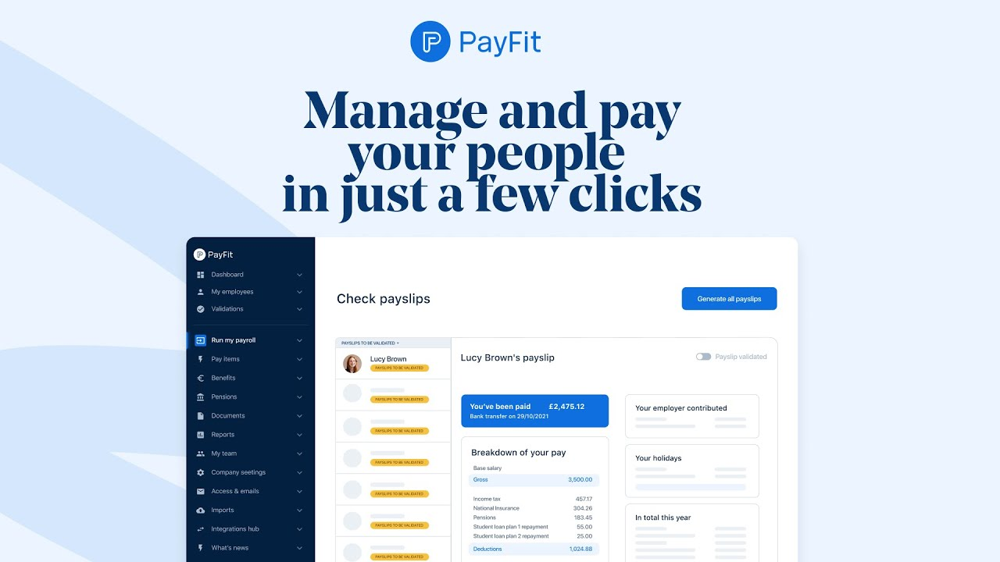

<div align="center">

[](https://payfit.com)

# Payfit<a id="payfit"></a>

A Semi-Private API to let third parties communicate with PayFit


</div>

## Table of Contents<a id="table-of-contents"></a>

<!-- toc -->

- [Requirements](#requirements)
- [Installation](#installation)
- [Getting Started](#getting-started)
- [Async](#async)
- [Raw HTTP Response](#raw-http-response)
- [Reference](#reference)
  * [`payfit.collaborator.collaborators`](#payfitcollaboratorcollaborators)
  * [`payfit.collaborator.get_by_id`](#payfitcollaboratorget_by_id)
  * [`payfit.collaborator.list_meal_vouchers`](#payfitcollaboratorlist_meal_vouchers)
  * [`payfit.collaborator.list_payslips`](#payfitcollaboratorlist_payslips)
  * [`payfit.collaborator.view_payslip`](#payfitcollaboratorview_payslip)
  * [`payfit.company.company`](#payfitcompanycompany)
  * [`payfit.company.company_accounting`](#payfitcompanycompany_accounting)
  * [`payfit.company.company_accounting_v2`](#payfitcompanycompany_accounting_v2)
  * [`payfit.company.company_payroll_status`](#payfitcompanycompany_payroll_status)
  * [`payfit.company.get_basic_info_fr`](#payfitcompanyget_basic_info_fr)
  * [`payfit.company.health_insurance_contracts`](#payfitcompanyhealth_insurance_contracts)
  * [`payfit.company.provident_fund_contracts`](#payfitcompanyprovident_fund_contracts)
  * [`payfit.contract.contract`](#payfitcontractcontract)
  * [`payfit.contract.contracts`](#payfitcontractcontracts)
  * [`payfit.contract.get_french_info`](#payfitcontractget_french_info)
  * [`payfit.contract.list_french_contracts`](#payfitcontractlist_french_contracts)
  * [`payfit.contract.list_worked_time_by_pay_period`](#payfitcontractlist_worked_time_by_pay_period)
  * [`payfit.contract.update_health_insurance_affiliation`](#payfitcontractupdate_health_insurance_affiliation)
  * [`payfit.contract.update_provident_fund_affiliation`](#payfitcontractupdate_provident_fund_affiliation)

<!-- tocstop -->

## Requirements<a id="requirements"></a>

Python >=3.7

## Installation<a id="installation"></a>
<div align="center">
  <a href="https://konfigthis.com/sdk-sign-up?company=PayFit&language=Python">
    
  </a>
</div>

## Getting Started<a id="getting-started"></a>

```python
from pprint import pprint
from pay_fit_python_sdk import PayFit, ApiException

payfit = PayFit(
    client_id="YOUR_CLIENT_ID",
    client_secret="YOUR_CLIENT_SECRET",
)

try:
    # List all Collaborators
    collaborators_response = payfit.collaborator.collaborators(
        company_id="companyId_example",
        next_page_token={},
        max_results={},
    )
    print(collaborators_response)
except ApiException as e:
    print("Exception when calling CollaboratorApi.collaborators: %s\n" % e)
    pprint(e.body)
    if e.status == 400:
        pprint(e.body["error"])
        pprint(e.body["details"])
    if e.status == 401:
        pprint(e.body["error"])
        pprint(e.body["details"])
    if e.status == 403:
        pprint(e.body["error"])
        pprint(e.body["details"])
    if e.status == 404:
        pprint(e.body["error"])
        pprint(e.body["details"])
    pprint(e.headers)
    pprint(e.status)
    pprint(e.reason)
    pprint(e.round_trip_time)
```

## Async<a id="async"></a>

`async` support is available by prepending `a` to any method.

```python
import asyncio
from pprint import pprint
from pay_fit_python_sdk import PayFit, ApiException

payfit = PayFit(
    client_id="YOUR_CLIENT_ID",
    client_secret="YOUR_CLIENT_SECRET",
)


async def main():
    try:
        # List all Collaborators
        collaborators_response = await payfit.collaborator.acollaborators(
            company_id="companyId_example",
            next_page_token={},
            max_results={},
        )
        print(collaborators_response)
    except ApiException as e:
        print("Exception when calling CollaboratorApi.collaborators: %s\n" % e)
        pprint(e.body)
        if e.status == 400:
            pprint(e.body["error"])
            pprint(e.body["details"])
        if e.status == 401:
            pprint(e.body["error"])
            pprint(e.body["details"])
        if e.status == 403:
            pprint(e.body["error"])
            pprint(e.body["details"])
        if e.status == 404:
            pprint(e.body["error"])
            pprint(e.body["details"])
        pprint(e.headers)
        pprint(e.status)
        pprint(e.reason)
        pprint(e.round_trip_time)


asyncio.run(main())
```

## Raw HTTP Response<a id="raw-http-response"></a>

To access raw HTTP response values, use the `.raw` namespace.

```python
from pprint import pprint
from pay_fit_python_sdk import PayFit, ApiException

payfit = PayFit(
    client_id="YOUR_CLIENT_ID",
    client_secret="YOUR_CLIENT_SECRET",
)

try:
    # List all Collaborators
    collaborators_response = payfit.collaborator.raw.collaborators(
        company_id="companyId_example",
        next_page_token={},
        max_results={},
    )
    pprint(collaborators_response.body)
    pprint(collaborators_response.body["collaborators"])
    pprint(collaborators_response.body["meta"])
    pprint(collaborators_response.headers)
    pprint(collaborators_response.status)
    pprint(collaborators_response.round_trip_time)
except ApiException as e:
    print("Exception when calling CollaboratorApi.collaborators: %s\n" % e)
    pprint(e.body)
    if e.status == 400:
        pprint(e.body["error"])
        pprint(e.body["details"])
    if e.status == 401:
        pprint(e.body["error"])
        pprint(e.body["details"])
    if e.status == 403:
        pprint(e.body["error"])
        pprint(e.body["details"])
    if e.status == 404:
        pprint(e.body["error"])
        pprint(e.body["details"])
    pprint(e.headers)
    pprint(e.status)
    pprint(e.reason)
    pprint(e.round_trip_time)
```


## Reference<a id="reference"></a>
### `payfit.collaborator.collaborators`<a id="payfitcollaboratorcollaborators"></a>

Returns all Collaborators. This list is paginated.

#### 🛠️ Usage<a id="🛠️-usage"></a>

```python
collaborators_response = payfit.collaborator.collaborators(
    company_id="companyId_example",
    next_page_token={},
    max_results={},
)
```

#### ⚙️ Parameters<a id="⚙️-parameters"></a>

##### company_id: `str`<a id="company_id-str"></a>

The id of the company

##### next_page_token: `Dict[str, Any]`<a id="next_page_token-dictstr-any"></a>

The encoded pagination token

##### max_results: `Dict[str, Any]`<a id="max_results-dictstr-any"></a>

Allows to define the maximum number of items to fetch at once. (Max: 50, Default: 10)

#### 🔄 Return<a id="🔄-return"></a>

[`GetCollaboratorsResponse`](./pay_fit_python_sdk/pydantic/get_collaborators_response.py)

#### 🌐 Endpoint<a id="🌐-endpoint"></a>

`/companies/{companyId}/collaborators` `get`

[🔙 **Back to Table of Contents**](#table-of-contents)

---

### `payfit.collaborator.get_by_id`<a id="payfitcollaboratorget_by_id"></a>

Returns the collaborator by ID.

#### 🛠️ Usage<a id="🛠️-usage"></a>

```python
get_by_id_response = payfit.collaborator.get_by_id(
    company_id="companyId_example",
    collaborator_id="collaboratorId_example",
)
```

#### ⚙️ Parameters<a id="⚙️-parameters"></a>

##### company_id: `str`<a id="company_id-str"></a>

The id of the company

##### collaborator_id: `str`<a id="collaborator_id-str"></a>

The id of collaborator to fetch

#### 🔄 Return<a id="🔄-return"></a>

[`CollaboratorGetByIdResponse`](./pay_fit_python_sdk/pydantic/collaborator_get_by_id_response.py)

#### 🌐 Endpoint<a id="🌐-endpoint"></a>

`/companies/{companyId}/collaborators/{collaboratorId}` `get`

[🔙 **Back to Table of Contents**](#table-of-contents)

---

### `payfit.collaborator.list_meal_vouchers`<a id="payfitcollaboratorlist_meal_vouchers"></a>

Returns all Collaborators Meal Vouchers for a given month.

#### 🛠️ Usage<a id="🛠️-usage"></a>

```python
list_meal_vouchers_response = payfit.collaborator.list_meal_vouchers(
    company_id="companyId_example",
    date="202212",
    next_page_token={},
    max_results={},
)
```

#### ⚙️ Parameters<a id="⚙️-parameters"></a>

##### company_id: `str`<a id="company_id-str"></a>

The id of the company

##### date: `str`<a id="date-str"></a>

The month to fetch the data for. This must be in the format YYYYMM, January being the month \"01\".

##### next_page_token: `Dict[str, Any]`<a id="next_page_token-dictstr-any"></a>

The encoded pagination token

##### max_results: `Dict[str, Any]`<a id="max_results-dictstr-any"></a>

Allows to define the maximum number of items to fetch at once. (Max: 50, Default: 10)

#### 🔄 Return<a id="🔄-return"></a>

[`CollaboratorListMealVouchersResponse`](./pay_fit_python_sdk/pydantic/collaborator_list_meal_vouchers_response.py)

#### 🌐 Endpoint<a id="🌐-endpoint"></a>

`/companies/{companyId}/collaborators/meal-vouchers` `get`

[🔙 **Back to Table of Contents**](#table-of-contents)

---

### `payfit.collaborator.list_payslips`<a id="payfitcollaboratorlist_payslips"></a>

Returns all the payslips of a collaborator by ID.

#### 🛠️ Usage<a id="🛠️-usage"></a>

```python
list_payslips_response = payfit.collaborator.list_payslips(
    company_id="companyId_example",
    collaborator_id="collaboratorId_example",
)
```

#### ⚙️ Parameters<a id="⚙️-parameters"></a>

##### company_id: `str`<a id="company_id-str"></a>

The id of the company

##### collaborator_id: `str`<a id="collaborator_id-str"></a>

The id of collaborator to fetch payslips

#### 🔄 Return<a id="🔄-return"></a>

[`CollaboratorListPayslipsResponse`](./pay_fit_python_sdk/pydantic/collaborator_list_payslips_response.py)

#### 🌐 Endpoint<a id="🌐-endpoint"></a>

`/companies/{companyId}/collaborators/{collaboratorId}/payslips` `get`

[🔙 **Back to Table of Contents**](#table-of-contents)

---

### `payfit.collaborator.view_payslip`<a id="payfitcollaboratorview_payslip"></a>

Returns a collaborator's payslip.

#### 🛠️ Usage<a id="🛠️-usage"></a>

```python
view_payslip_response = payfit.collaborator.view_payslip(
    company_id="companyId_example",
    collaborator_id="collaboratorId_example",
    contract_id="contractId_example",
    payslip_id="payslipId_example",
)
```

#### ⚙️ Parameters<a id="⚙️-parameters"></a>

##### company_id: `str`<a id="company_id-str"></a>

The id of the company

##### collaborator_id: `str`<a id="collaborator_id-str"></a>

The id of collaborator to fetch

##### contract_id: `str`<a id="contract_id-str"></a>

The id of the contract

##### payslip_id: `str`<a id="payslip_id-str"></a>

The id of the payslip

#### 🌐 Endpoint<a id="🌐-endpoint"></a>

`/companies/{companyId}/collaborators/{collaboratorId}/contracts/{contractId}/payslips/{payslipId}` `get`

[🔙 **Back to Table of Contents**](#table-of-contents)

---

### `payfit.company.company`<a id="payfitcompanycompany"></a>

Returns the basic information of the company.

#### 🛠️ Usage<a id="🛠️-usage"></a>

```python
company_response = payfit.company.company(
    company_id="companyId_example",
)
```

#### ⚙️ Parameters<a id="⚙️-parameters"></a>

##### company_id: `str`<a id="company_id-str"></a>

The id of the company

#### 🔄 Return<a id="🔄-return"></a>

[`GetCompanyResponse`](./pay_fit_python_sdk/pydantic/get_company_response.py)

#### 🌐 Endpoint<a id="🌐-endpoint"></a>

`/companies/{companyId}` `get`

[🔙 **Back to Table of Contents**](#table-of-contents)

---

### `payfit.company.company_accounting`<a id="payfitcompanycompany_accounting"></a>

Returns accounting of the company for a given month. The data is structured as CSV.

#### 🛠️ Usage<a id="🛠️-usage"></a>

```python
company_accounting_response = payfit.company.company_accounting(
    company_id="companyId_example",
    date="202212",
)
```

#### ⚙️ Parameters<a id="⚙️-parameters"></a>

##### company_id: `str`<a id="company_id-str"></a>

The id of the company

##### date: `str`<a id="date-str"></a>

The month to fetch the data for. This must be in the format YYYYMM, January being the month \"01\".

#### 🌐 Endpoint<a id="🌐-endpoint"></a>

`/companies/{companyId}/accounting` `get`

[🔙 **Back to Table of Contents**](#table-of-contents)

---

### `payfit.company.company_accounting_v2`<a id="payfitcompanycompany_accounting_v2"></a>

Get accounting v2 data for a company in JSON format

#### 🛠️ Usage<a id="🛠️-usage"></a>

```python
company_accounting_v2_response = payfit.company.company_accounting_v2(
    company_id="companyId_example",
    date="202212",
)
```

#### ⚙️ Parameters<a id="⚙️-parameters"></a>

##### company_id: `str`<a id="company_id-str"></a>

The id of the company

##### date: `str`<a id="date-str"></a>

The month to fetch the data for. This must be in the format YYYYMM, January being the month \"01\".

#### 🔄 Return<a id="🔄-return"></a>

[`GetCompanyAccountingV2Response`](./pay_fit_python_sdk/pydantic/get_company_accounting_v2_response.py)

#### 🌐 Endpoint<a id="🌐-endpoint"></a>

`/companies/{companyId}/accounting-v2` `get`

[🔙 **Back to Table of Contents**](#table-of-contents)

---

### `payfit.company.company_payroll_status`<a id="payfitcompanycompany_payroll_status"></a>

Returns the payroll status on a given pay period.

#### 🛠️ Usage<a id="🛠️-usage"></a>

```python
company_payroll_status_response = payfit.company.company_payroll_status(
    company_id="companyId_example",
    date="202212",
)
```

#### ⚙️ Parameters<a id="⚙️-parameters"></a>

##### company_id: `str`<a id="company_id-str"></a>

The id of the company

##### date: `str`<a id="date-str"></a>

The month to fetch the data for. This must be in the format YYYYMM, January being the month \"01\".

#### 🔄 Return<a id="🔄-return"></a>

[`GetCompanyPayrollStatusResponse`](./pay_fit_python_sdk/pydantic/get_company_payroll_status_response.py)

#### 🌐 Endpoint<a id="🌐-endpoint"></a>

`/companies/{companyId}/payroll-status` `get`

[🔙 **Back to Table of Contents**](#table-of-contents)

---

### `payfit.company.get_basic_info_fr`<a id="payfitcompanyget_basic_info_fr"></a>

Returns the basic information of the company with french specific data.

#### 🛠️ Usage<a id="🛠️-usage"></a>

```python
get_basic_info_fr_response = payfit.company.get_basic_info_fr(
    company_id="companyId_example",
)
```

#### ⚙️ Parameters<a id="⚙️-parameters"></a>

##### company_id: `str`<a id="company_id-str"></a>

The id of the company

#### 🔄 Return<a id="🔄-return"></a>

[`CompanyGetBasicInfoFrResponse`](./pay_fit_python_sdk/pydantic/company_get_basic_info_fr_response.py)

#### 🌐 Endpoint<a id="🌐-endpoint"></a>

`/companies-fr/{companyId}` `get`

[🔙 **Back to Table of Contents**](#table-of-contents)

---

### `payfit.company.health_insurance_contracts`<a id="payfitcompanyhealth_insurance_contracts"></a>

Returns all Health Insurance contracts.

#### 🛠️ Usage<a id="🛠️-usage"></a>

```python
health_insurance_contracts_response = payfit.company.health_insurance_contracts(
    company_id="companyId_example",
)
```

#### ⚙️ Parameters<a id="⚙️-parameters"></a>

##### company_id: `str`<a id="company_id-str"></a>

The id of the company

#### 🔄 Return<a id="🔄-return"></a>

[`GetHealthInsuranceContractsResponse`](./pay_fit_python_sdk/pydantic/get_health_insurance_contracts_response.py)

#### 🌐 Endpoint<a id="🌐-endpoint"></a>

`/companies/{companyId}/health-insurance-contracts` `get`

[🔙 **Back to Table of Contents**](#table-of-contents)

---

### `payfit.company.provident_fund_contracts`<a id="payfitcompanyprovident_fund_contracts"></a>

Returns all Provident Fund contracts.

#### 🛠️ Usage<a id="🛠️-usage"></a>

```python
provident_fund_contracts_response = payfit.company.provident_fund_contracts(
    company_id="companyId_example",
)
```

#### ⚙️ Parameters<a id="⚙️-parameters"></a>

##### company_id: `str`<a id="company_id-str"></a>

The id of the company

#### 🔄 Return<a id="🔄-return"></a>

[`GetProvidentFundContractsResponse`](./pay_fit_python_sdk/pydantic/get_provident_fund_contracts_response.py)

#### 🌐 Endpoint<a id="🌐-endpoint"></a>

`/companies/{companyId}/provident-fund-contracts` `get`

[🔙 **Back to Table of Contents**](#table-of-contents)

---

### `payfit.contract.contract`<a id="payfitcontractcontract"></a>

Returns a contract information by ID.

#### 🛠️ Usage<a id="🛠️-usage"></a>

```python
contract_response = payfit.contract.contract(
    company_id="companyId_example",
    contract_id="contractId_example",
)
```

#### ⚙️ Parameters<a id="⚙️-parameters"></a>

##### company_id: `str`<a id="company_id-str"></a>

The id of the company

##### contract_id: `str`<a id="contract_id-str"></a>

The id of the contract

#### 🔄 Return<a id="🔄-return"></a>

[`GetContractResponse`](./pay_fit_python_sdk/pydantic/get_contract_response.py)

#### 🌐 Endpoint<a id="🌐-endpoint"></a>

`/companies/{companyId}/contracts/{contractId}` `get`

[🔙 **Back to Table of Contents**](#table-of-contents)

---

### `payfit.contract.contracts`<a id="payfitcontractcontracts"></a>

Returns all Contracts. This list is paginated.

#### 🛠️ Usage<a id="🛠️-usage"></a>

```python
contracts_response = payfit.contract.contracts(
    company_id="companyId_example",
    next_page_token={},
    max_results={},
)
```

#### ⚙️ Parameters<a id="⚙️-parameters"></a>

##### company_id: `str`<a id="company_id-str"></a>

The id of the company

##### next_page_token: `Dict[str, Any]`<a id="next_page_token-dictstr-any"></a>

The encoded pagination token

##### max_results: `Dict[str, Any]`<a id="max_results-dictstr-any"></a>

Allows to define the maximum number of items to fetch at once. (Max: 50, Default: 10)

#### 🔄 Return<a id="🔄-return"></a>

[`GetContractsResponse`](./pay_fit_python_sdk/pydantic/get_contracts_response.py)

#### 🌐 Endpoint<a id="🌐-endpoint"></a>

`/companies/{companyId}/contracts` `get`

[🔙 **Back to Table of Contents**](#table-of-contents)

---

### `payfit.contract.get_french_info`<a id="payfitcontractget_french_info"></a>

Returns a contract information by ID with french specific data.

#### 🛠️ Usage<a id="🛠️-usage"></a>

```python
get_french_info_response = payfit.contract.get_french_info(
    company_id="companyId_example",
    contract_id="contractId_example",
)
```

#### ⚙️ Parameters<a id="⚙️-parameters"></a>

##### company_id: `str`<a id="company_id-str"></a>

The id of the company

##### contract_id: `str`<a id="contract_id-str"></a>

The id of the contract

#### 🔄 Return<a id="🔄-return"></a>

[`ContractGetFrenchInfoResponse`](./pay_fit_python_sdk/pydantic/contract_get_french_info_response.py)

#### 🌐 Endpoint<a id="🌐-endpoint"></a>

`/companies/{companyId}/contracts-fr/{contractId}` `get`

[🔙 **Back to Table of Contents**](#table-of-contents)

---

### `payfit.contract.list_french_contracts`<a id="payfitcontractlist_french_contracts"></a>

Returns all Contracts with french specific data. This list is paginated.

#### 🛠️ Usage<a id="🛠️-usage"></a>

```python
list_french_contracts_response = payfit.contract.list_french_contracts(
    company_id="companyId_example",
    next_page_token={},
    max_results={},
    fields=["string_example"],
)
```

#### ⚙️ Parameters<a id="⚙️-parameters"></a>

##### company_id: `str`<a id="company_id-str"></a>

The id of the company

##### next_page_token: `Dict[str, Any]`<a id="next_page_token-dictstr-any"></a>

The encoded pagination token

##### max_results: `Dict[str, Any]`<a id="max_results-dictstr-any"></a>

Allows to define the maximum number of items to fetch at once. (Max: 50, Default: 10)

##### fields: List[`str`]<a id="fields-liststr"></a>

Deprecated. The groups of fields to include in the response, in addition to the default fields. | Possible values are \"securite-sociale\" (it will require the `collaborators:social-security:read` oauth scope)

#### 🔄 Return<a id="🔄-return"></a>

[`ContractListFrenchContractsResponse`](./pay_fit_python_sdk/pydantic/contract_list_french_contracts_response.py)

#### 🌐 Endpoint<a id="🌐-endpoint"></a>

`/companies/{companyId}/contracts-fr` `get`

[🔙 **Back to Table of Contents**](#table-of-contents)

---

### `payfit.contract.list_worked_time_by_pay_period`<a id="payfitcontractlist_worked_time_by_pay_period"></a>

Returns the worked time for every contract for the given pay period. This list is paginated.

#### 🛠️ Usage<a id="🛠️-usage"></a>

```python
list_worked_time_by_pay_period_response = (
    payfit.contract.list_worked_time_by_pay_period(
        company_id="companyId_example",
        date="202212",
        next_page_token={},
        max_results={},
    )
)
```

#### ⚙️ Parameters<a id="⚙️-parameters"></a>

##### company_id: `str`<a id="company_id-str"></a>

The id of the company

##### date: `str`<a id="date-str"></a>

The month to fetch the data for. This must be in the format YYYYMM, January being the month \"01\".

##### next_page_token: `Dict[str, Any]`<a id="next_page_token-dictstr-any"></a>

The encoded pagination token

##### max_results: `Dict[str, Any]`<a id="max_results-dictstr-any"></a>

Allows to define the maximum number of items to fetch at once. (Max: 50, Default: 10)

#### 🔄 Return<a id="🔄-return"></a>

[`ContractListWorkedTimeByPayPeriodResponse`](./pay_fit_python_sdk/pydantic/contract_list_worked_time_by_pay_period_response.py)

#### 🌐 Endpoint<a id="🌐-endpoint"></a>

`/companies/{companyId}/contracts/time` `get`

[🔙 **Back to Table of Contents**](#table-of-contents)

---

### `payfit.contract.update_health_insurance_affiliation`<a id="payfitcontractupdate_health_insurance_affiliation"></a>

Allows the affiliation of an health insurance to an employee contract.

#### 🛠️ Usage<a id="🛠️-usage"></a>

```python
update_health_insurance_affiliation_response = (
    payfit.contract.update_health_insurance_affiliation(
        health_insurance_contract_ids=["string_example"],
        company_id="companyId_example",
        contract_id="contractId_example",
    )
)
```

#### ⚙️ Parameters<a id="⚙️-parameters"></a>

##### health_insurance_contract_ids: [`ContractUpdateHealthInsuranceAffiliationRequestHealthInsuranceContractIds`](./pay_fit_python_sdk/type/contract_update_health_insurance_affiliation_request_health_insurance_contract_ids.py)<a id="health_insurance_contract_ids-contractupdatehealthinsuranceaffiliationrequesthealthinsurancecontractidspay_fit_python_sdktypecontract_update_health_insurance_affiliation_request_health_insurance_contract_idspy"></a>

##### company_id: `str`<a id="company_id-str"></a>

The id of the company

##### contract_id: `str`<a id="contract_id-str"></a>

The id of the contract

#### ⚙️ Request Body<a id="⚙️-request-body"></a>

[`ContractUpdateHealthInsuranceAffiliationRequest`](./pay_fit_python_sdk/type/contract_update_health_insurance_affiliation_request.py)
#### 🌐 Endpoint<a id="🌐-endpoint"></a>

`/companies/{companyId}/contracts-fr/{contractId}/health-insurance` `put`

[🔙 **Back to Table of Contents**](#table-of-contents)

---

### `payfit.contract.update_provident_fund_affiliation`<a id="payfitcontractupdate_provident_fund_affiliation"></a>

Allows the affiliation of a provident fund to an employee contract.

#### 🛠️ Usage<a id="🛠️-usage"></a>

```python
update_provident_fund_affiliation_response = (
    payfit.contract.update_provident_fund_affiliation(
        provident_fund_contract_ids=["string_example"],
        company_id="companyId_example",
        contract_id="contractId_example",
    )
)
```

#### ⚙️ Parameters<a id="⚙️-parameters"></a>

##### provident_fund_contract_ids: [`ContractUpdateProvidentFundAffiliationRequestProvidentFundContractIds`](./pay_fit_python_sdk/type/contract_update_provident_fund_affiliation_request_provident_fund_contract_ids.py)<a id="provident_fund_contract_ids-contractupdateprovidentfundaffiliationrequestprovidentfundcontractidspay_fit_python_sdktypecontract_update_provident_fund_affiliation_request_provident_fund_contract_idspy"></a>

##### company_id: `str`<a id="company_id-str"></a>

The id of the company

##### contract_id: `str`<a id="contract_id-str"></a>

The id of the contract

#### ⚙️ Request Body<a id="⚙️-request-body"></a>

[`ContractUpdateProvidentFundAffiliationRequest`](./pay_fit_python_sdk/type/contract_update_provident_fund_affiliation_request.py)
#### 🌐 Endpoint<a id="🌐-endpoint"></a>

`/companies/{companyId}/contracts-fr/{contractId}/provident-fund` `put`

[🔙 **Back to Table of Contents**](#table-of-contents)

---


## Author<a id="author"></a>
This Python package is automatically generated by [Konfig](https://konfigthis.com)
